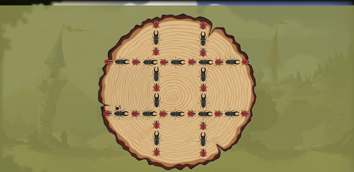

# Project-2: Fantasy Land

## Badge


## Title
Fantasy Land

## Table of Contents
- [Project-2: Fantasy Land](#project-2-fantasy-land)
  - [Badge](#badge)
  - [Title](#title)
  - [Table of Contents](#table-of-contents)
  - [User Story](#user-story)
  - [Desscription](#desscription)
  - [Mock-Up](#mock-up)
  - [Usage](#usage)
  - [Features](#features)
  - [Wireframe](#wireframe)
  - [Presentation](#presentation)
  - [Tech](#tech)
  - [Roles](#roles)
  - [License](#license)
  - [Link](#link)

## User Story
```md
As a user
I want to have a gaming website
that me and my friends can play on together.
So that I can play against them and save my scores.
```

## Desscription
When I open the webpage, 
I am prompted to log in or sign up.

When I click 'sign up', 
I am asked to create an account with my name, email, and chosen password.

When I click 'log in', 
I am prompted for my email and password.

Then I am given a webpage that displays the games available, page navigation buttons and my friends list.

When I click 'Tic Tac Toe', 
Then I am taken to the game play page for Tic Tac Toe.
[How to play](https://www.wikihow.com/Play-Tic-Tac-Toe)

When I click 'Connect Four', 
Then I am taken to the game play page for Connect Four.
[How to play](https://www.wikihow.com/Win-at-Connect-4)
```md
Our game requires 2 players, please invite your friends to join by sending them our website link.
```

When I play the game, 
Then my score is saved to my ranks page.

When I click 'Rank', 
Then I am shown a list of my past highscores.
```md
Each user will have 1000 points at the beginning. Every time you win, you will get +10 points, if you lose, you will get -10 points
```

When I click 'Profile', 
Then I am taken to the profile page.

When I click 'Upload', 
Then I can choose an image file in my computer to replace the avatar.

When i input in 'NEW USERNAME' and click submit, 
Then I will update the selected new user name and avatar.

When I click 'Home', 
Then I am taken back to the main page.

When I click 'log out', 
I am logged out of the session.

## Mock-Up
The following image shows the web application's appearance:

[Main-Function]

[Tic-Tac-Toe-Game]

[Connect-Four-Game]

## Usage
npm i, 
mysql -u -p, 
SOURCE db/schema.sql, 
create .env file, use .env-sample as reference, 
npm run start, 
npm run seed.

## Features
Signup, login, logout.

View profile infomation, friend list and rank/highscores.

Change username and avatar.

Play Tic Tac Toe and Connect Four game with friends.

## Wireframe
[Wireframe link](https://excalidraw.com/#json=f1Wo5FXQbrBuQeLLlGlQK,T7biAC9iVYNhaPKX-_ccIg)

## Presentation
[Presentation link](https://docs.google.com/presentation/d/16ID6CC7J01BfiAC2JsMDT0Ub5k-6QDPmBPz4wJ8JOHY/edit?usp=sharing)

## Tech
- [HTML](https://developer.mozilla.org/en-US/docs/Web/HTML)
- [CSS](https://developer.mozilla.org/en-US/docs/Web/CSS)
- [Javascript](https://developer.mozilla.org/en-US/docs/Web/javascript)
- [Express.js](https://expressjs.com/)
- [Node.js](https://nodejs.org/en/)
- [Sequelize](https://sequelize.org/)
- [MySQL2](https://www.npmjs.com/package/mysql2)
- [Fetch](https://developer.mozilla.org/en-US/docs/Web/API/Fetch_API)
- [Socket.io](https://momentjs.com/)
- [Handlebars](https://handlebarsjs.com/)
- [Auth Sess+ Cookies](https://stackoverflow.com/questions/17769011/how-does-cookie-based-authentication-work)
- [Env Var](https://www.npmjs.com/package/env-var)
- [Cloudinary](https://cloudinary.com/)
- [Heroku](https://dashboard.heroku.com/)

## Roles
[Brian Bixby](https://github.com/brianbixby) : Git Administrator,lead on backend,functionality

[Hannah Callison](https://github.com/hannahcallison) : Project Manager, lead on fontend,layout and styling
 
[James Harding](https://github.com/JaHa675) : lead on backend,functionality

[MinhKhoi Nguyen](https://github.com/minhkhoinguy) : lead on fontend,functionality

Contact us with the link above if you have any questions!

## License
[MIT License ](LICENSE.txt)

## Link
[Github: Project 2](https://github.com/brianbixby/project-2)

[Heroku: Project 2](https://calm-fjord-53373.herokuapp.com/)
